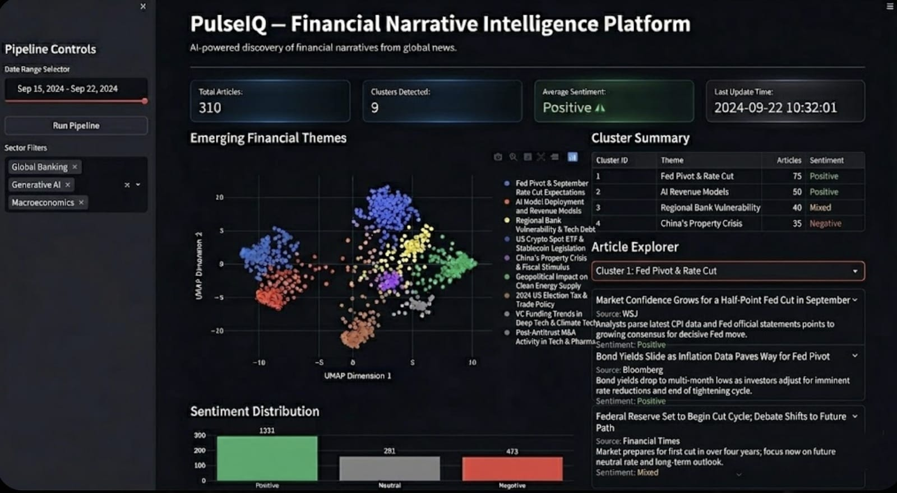

# PulseIQ — Financial Narrative Intelligence Platform



## Overview

PulseIQ is an AI-powered financial news intelligence system that automatically discovers emerging financial themes from global news articles.

The system collects financial news from APIs, processes articles using transformer-based embeddings, groups related articles using unsupervised clustering, analyzes sentiment, and visualizes the results through an interactive dashboard.

Instead of manually reading hundreds of articles, PulseIQ helps identify **major narratives shaping financial markets**.

---

## Key Features

### Financial News Ingestion

Fetches real-time financial news using NewsAPI and stores articles locally in a SQLite database.

### Transformer Embeddings

Converts articles into semantic vectors using SentenceTransformers (`thenlper/gte-small`) so similar financial topics appear close in vector space.

### Topic Discovery

Uses dimensionality reduction (PCA + UMAP) followed by HDBSCAN clustering to automatically group articles into meaningful financial themes.

### Sentiment Analysis

Uses FinBERT to analyze sentiment for each article and compute average sentiment for each cluster.

### Interactive Dashboard

A Streamlit dashboard visualizes:

* Discovered financial themes
* Articles belonging to each theme
* Sentiment distribution
* Cluster visualization

---

## System Architecture

Financial News API
↓
News Ingestion Service
↓
SQLite Database
↓
Embedding Engine (SentenceTransformer)
↓
Dimensionality Reduction (PCA → UMAP)
↓
Clustering Engine (HDBSCAN)
↓
Sentiment Analysis (FinBERT)
↓
Streamlit Visualization Dashboard

---

## Project Structure

```
pulseiq/
│
├── backend/
│   ├── fetch_news.py
│   ├── database.py
│   ├── embed_articles.py
│   ├── cluster_articles.py
│   ├── sentiment_analysis.py
│
├── data/
│   ├── news.db
│   └── embeddings.npy
│
├── models/
│
├── app.py
├── requirements.txt
└── README.md
```

### backend/

Contains the core backend and ML pipeline modules.

### data/

Stores the SQLite database and generated embeddings.

### models/

Optional directory for storing downloaded ML models.

### app.py

Streamlit dashboard application.

---

## Database Design

### articles

Stores raw financial news articles.

| Column       | Description               |
| ------------ | ------------------------- |
| id           | Unique article identifier |
| title        | Article headline          |
| description  | Short article summary     |
| source       | News source               |
| url          | Article link              |
| published_at | Publication timestamp     |

### embeddings

Stores embedding vectors generated for each article.

| Column     | Description              |
| ---------- | ------------------------ |
| article_id | Reference to article     |
| vector     | Embedding representation |

### clusters

Stores cluster assignment for each article.

| Column        | Description          |
| ------------- | -------------------- |
| article_id    | Reference to article |
| cluster_label | Cluster identifier   |

### sentiment

Stores sentiment score for each article.

| Column          | Description          |
| --------------- | -------------------- |
| article_id      | Reference to article |
| sentiment_score | Sentiment polarity   |

---

## Machine Learning Pipeline

1. News articles are collected from NewsAPI.
2. Title and description are combined into a single text input.
3. SentenceTransformer generates semantic embeddings.
4. PCA reduces dimensionality to remove noise.
5. UMAP further compresses vectors while preserving structure.
6. HDBSCAN discovers clusters of related financial topics.
7. FinBERT computes sentiment for each article.
8. Results are visualized in the dashboard.

---

## Installation

Clone the repository:

```
git clone https://github.com/yourusername/pulseiq.git
cd pulseq
```

Create virtual environment:

```
python3 -m venv venv
source venv/bin/activate
```

Install dependencies:

```
pip install -r requirements.txt
```

---

## Running the System

Fetch financial news:

```
python backend/fetch_news.py
```

Generate embeddings:

```
python backend/embed_articles.py
```

Cluster articles:

```
python backend/cluster_articles.py
```

Run dashboard:

```
streamlit run app.py
```

---

## Example Use Cases

* Discover emerging financial themes in global markets
* Track sentiment around economic events
* Analyze narrative shifts in financial news
* Explore relationships between news topics

---

## Future Improvements

* Real-time news streaming
* Stock market correlation analysis
* Trend tracking over time
* Advanced financial entity extraction
* Cloud deployment

---

## Tech Stack

Python
SentenceTransformers
UMAP
HDBSCAN
FinBERT
SQLite
Streamlit

---

