# PulseIQ — Financial Narrative Intelligence Platform

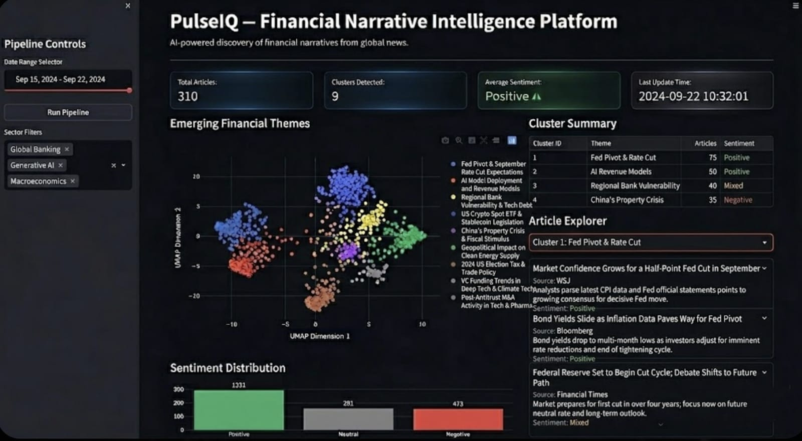

> **Discover emerging market themes from global financial news using ML clustering, transformer embeddings, and FinBERT sentiment analysis.**

---

## What It Does

PulseIQ ingests hundreds of financial news articles, converts them into semantic vectors, clusters related stories into narrative themes, scores each article's sentiment, and visualises everything through a real-time interactive dashboard.

Instead of manually reading hundreds of articles, PulseIQ surfaces the **major narratives shaping financial markets** — and tells you whether the tone is bullish, bearish, or neutral.

---

## Tech Stack

| Layer | Technology |
|-------|-----------|
| **Embeddings** | `thenlper/gte-small` (SentenceTransformers, 384-dim) |
| **Dim. Reduction** | PCA (50d) → UMAP (5d for clustering, 2d for viz) |
| **Clustering** | HDBSCAN (auto-detects # of clusters, handles noise) + TF-IDF cluster naming |
| **Sentiment** | ProsusAI/FinBERT (fine-tuned on financial text) |
| **Backend API** | FastAPI + Pydantic + SlowAPI (Rate Limiting) |
| **Frontend** | Streamlit,Next.js |
| **Database** | SQLAlchemy (SQLite local / PostgreSQL production) |
| **Data Source** | NewsAPI + RSS (financial news) with APScheduler & RapidFuzz deduplication |
| **Real-time** | Server-Sent Events (SSE) for pipeline streaming |

---

## Architecture

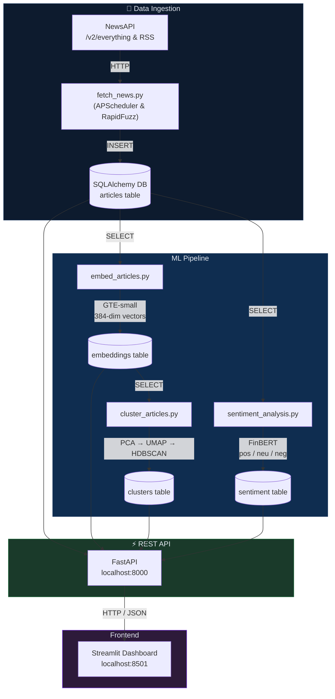
```mermaid
flowchart TB
    subgraph DATA ["📰 Data Ingestion"]
        A["NewsAPI\n/v2/everything & RSS"] -->|HTTP| B["fetch_news.py\n(APScheduler & RapidFuzz)"]
        B -->|INSERT| C[("SQLAlchemy DB\narticles table")]
    end

    subgraph ML [" ML Pipeline"]
        C -->|SELECT| D["embed_articles.py"]
        D -->|"GTE-small\n384-dim vectors"| E[("embeddings table")]
        E -->|SELECT| F["cluster_articles.py"]
        F -->|"PCA → UMAP → HDBSCAN"| G[("clusters table")]
        C -->|SELECT| H["sentiment_analysis.py"]
        H -->|"FinBERT\npos / neu / neg"| I[("sentiment table")]
    end

    subgraph API ["⚡ REST API"]
        J["FastAPI\nlocalhost:8000"]
    end

    subgraph UI [" Frontend"]
        K["Streamlit Dashboard\nlocalhost:8501"]
    end

    C & E & G & I --> J
    J -->|"HTTP / JSON"| K

    style DATA fill:#0d1b2e,stroke:#1e3a5f,color:#e2e8f0
    style ML fill:#0f2d50,stroke:#1e3a5f,color:#e2e8f0
    style API fill:#1a3a2a,stroke:#166534,color:#e2e8f0
    style UI fill:#2d1a3a,stroke:#7c3aed,color:#e2e8f0
```

The frontend **never** imports from `backend/` — all data flows through the HTTP API, making the system cleanly decoupled.

---

## Project Structure

```
PulseIq/
├── backend/
│   ├── database.py            # SQLAlchemy helper (schema, CRUD, batch ops)
│   ├── fetch_news.py          # NewsAPI ingestion (fuzzy deduplication)
│   ├── fetch_rss.py           # RSS fallback ingestion
│   ├── scheduler.py           # APScheduler background pipeline runner
│   ├── embed_articles.py      # GTE-small embedding generation
│   ├── cluster_articles.py    # PCA → UMAP → HDBSCAN + TF-IDF naming & tracking
│   ├── sentiment_analysis.py  # FinBERT sentiment scoring
│   ├── market_benchmark.py    # SPY correlation testing
│   └── pipeline.py            # Orchestrates all stages end-to-end
│
├── api/
│   ├── main.py                # FastAPI app (mounts all routers)
│   ├── schemas.py             # Pydantic request/response models
│   └── routers/
│       ├── articles.py        # GET /api/articles, UMAP coords (Cached)
│       ├── clusters.py        # GET /api/clusters (Cached)
│       ├── sentiment.py       # GET /api/sentiment/overview + timeline (Cached)
│       ├── pipeline.py        # POST /api/pipeline/run (Auth Required)
│       ├── realtime.py        # GET /api/pipeline/stream (SSE)
│       └── stats.py           # GET /api/stats (Cached)
│
├── frontend/
│   └── api_client.py          # HTTP client for Streamlit ↔ FastAPI
│
├── data/
│   ├── seed_articles.json     # Pre-generated dataset (no API key needed)
│   └── news.db                # SQLite database (auto-created)
│
├── models/                    # Saved PCA/UMAP/HDBSCAN models + UMAP coords
├── images/                    # Generated ML pipeline charts (PNG)
│   ├── similarity_matrix.png
│   ├── pca_variance.png
│   ├── umap_clusters.png
│   ├── sentiment_overlay.png
│   ├── sentiment_donut.png
│   ├── sentiment_distribution.png
│   ├── sentiment_by_cluster.png
│   └── sentiment_timeline.png
│
├── app.py                     # Streamlit dashboard
├── seed_db.py                 # Load seed data into DB
├── run_pipeline.py            # CLI pipeline runner
├── requirements.txt
└── README.md
```

---

## Database Schema

### articles
| Column | Type | Description |
|--------|------|-------------|
| id | INTEGER PK | Auto-increment ID |
| title | TEXT | Article headline |
| description | TEXT | Short summary |
| source | TEXT | News source name |
| url | TEXT UNIQUE | Article URL |
| published_at | TEXT | Publication timestamp |

### embeddings
| Column | Type | Description |
|--------|------|-------------|
| article_id | INTEGER PK/FK | References articles(id) |
| vector | BLOB | Serialised float32 numpy array |
| dim | INTEGER | Vector dimensionality (384) |

### clusters
| Column | Type | Description |
|--------|------|-------------|
| article_id | INTEGER PK/FK | References articles(id) |
| cluster_label | INTEGER | HDBSCAN label (-1 = noise) |

### sentiment
| Column | Type | Description |
|--------|------|-------------|
| article_id | INTEGER PK/FK | References articles(id) |
| label | TEXT | "positive" / "neutral" / "negative" |
| sentiment_score | REAL | Signed score in [-1.0, +1.0] |

---


## ML Pipeline Details

### Embedding → Clustering Pipeline

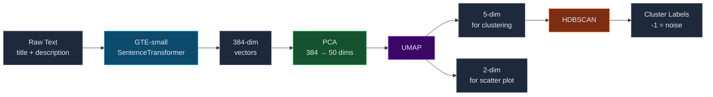
```mermaid
flowchart LR
    A[" Raw Text\ntitle + description"] --> B[" GTE-small\nSentenceTransformer"]
    B --> C["384-dim\nvectors"]
    C --> D[" PCA\n384 → 50 dims"]
    D --> E[" UMAP"]
    E --> F["5-dim\nfor clustering"]
    E --> G["2-dim\nfor scatter plot"]
    F --> H[" HDBSCAN"]
    H --> I["Cluster Labels\n-1 = noise"]

    style A fill:#1e293b,stroke:#475569,color:#e2e8f0
    style B fill:#0c4a6e,stroke:#0ea5e9,color:#e2e8f0
    style C fill:#1e293b,stroke:#475569,color:#e2e8f0
    style D fill:#14532d,stroke:#22c55e,color:#e2e8f0
    style E fill:#3b0764,stroke:#a855f7,color:#e2e8f0
    style F fill:#1e293b,stroke:#475569,color:#e2e8f0
    style G fill:#1e293b,stroke:#475569,color:#e2e8f0
    style H fill:#7c2d12,stroke:#f97316,color:#e2e8f0
    style I fill:#1e293b,stroke:#475569,color:#e2e8f0
```

### Sentiment Analysis Pipeline

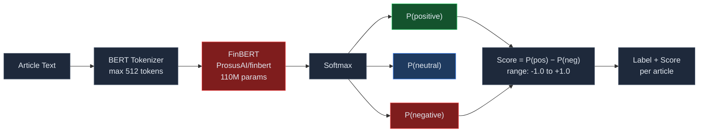
```mermaid
flowchart LR
    A[" Article Text"] --> B[" BERT Tokenizer\nmax 512 tokens"]
    B --> C[" FinBERT\nProsusAI/finbert\n110M params"]
    C --> D["Softmax"]
    D --> E["P(positive)"]
    D --> F["P(neutral)"]
    D --> G["P(negative)"]
    E & G --> H["Score = P(pos) − P(neg)\nrange: -1.0 to +1.0"]
    H --> I[" Label + Score\nper article"]

    style A fill:#1e293b,stroke:#475569,color:#e2e8f0
    style B fill:#1e293b,stroke:#475569,color:#e2e8f0
    style C fill:#7f1d1d,stroke:#ef4444,color:#e2e8f0
    style D fill:#1e293b,stroke:#475569,color:#e2e8f0
    style E fill:#14532d,stroke:#22c55e,color:#e2e8f0
    style F fill:#1e3a5f,stroke:#3b82f6,color:#e2e8f0
    style G fill:#7f1d1d,stroke:#ef4444,color:#e2e8f0
    style H fill:#1e293b,stroke:#475569,color:#e2e8f0
    style I fill:#1e293b,stroke:#475569,color:#e2e8f0
```

### Model Details

| Model | Task | Parameters | Input | Output | Why This Model? |
|-------|------|-----------|-------|--------|-----------------|
| **GTE-small** | Embedding | 33M | Text string | 384-dim float32 vector | Strong on short financial text; fast on CPU/MPS |
| **PCA** | Dim. reduction | — | 384-dim | 50-dim | Removes noise, retains ~95% variance |
| **UMAP** | Manifold learning | — | 50-dim | 5-dim / 2-dim | Preserves local structure; better than t-SNE |
| **HDBSCAN** | Clustering | — | 5-dim vectors | Integer labels | Auto-detects cluster count; handles noise |
| **FinBERT** | Sentiment | 110M | Text string | 3 class probabilities | Fine-tuned on financial news & analyst reports |

### Dimensionality Reduction Flow

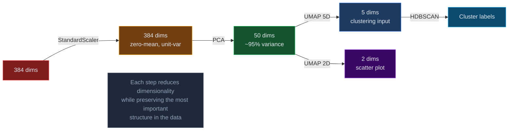
```mermaid
flowchart LR
    A["384 dims"] -->|"StandardScaler"| B["384 dims\nzero-mean, unit-var"]
    B -->|"PCA"| C["50 dims\n~95% variance"]
    C -->|"UMAP 5D"| D["5 dims\nclustering input"]
    C -->|"UMAP 2D"| E["2 dims\nscatter plot"]
    D -->|"HDBSCAN"| F["Cluster labels"]

    A ~~~ G["Each step reduces dimensionality\nwhile preserving the most important\nstructure in the data"]

    style A fill:#7f1d1d,stroke:#ef4444,color:#e2e8f0
    style B fill:#713f12,stroke:#f59e0b,color:#e2e8f0
    style C fill:#14532d,stroke:#22c55e,color:#e2e8f0
    style D fill:#1e3a5f,stroke:#3b82f6,color:#e2e8f0
    style E fill:#3b0764,stroke:#a855f7,color:#e2e8f0
    style F fill:#0c4a6e,stroke:#0ea5e9,color:#e2e8f0
    style G fill:#1e293b,stroke:#475569,color:#94a3b8
```

---

## Model Analytics & Visualisation Gallery


### 1. Document Semantic Clustering (UMAP 2D Projection)
This scatter plot shows the 384-dimensional article embeddings reduced to 2D via UMAP. Articles are colored according to their HDBSCAN clusters, representing discovered narrative themes (e.g. Fed monetary policy, tech earnings, cryptocurrency rally, energy markets).
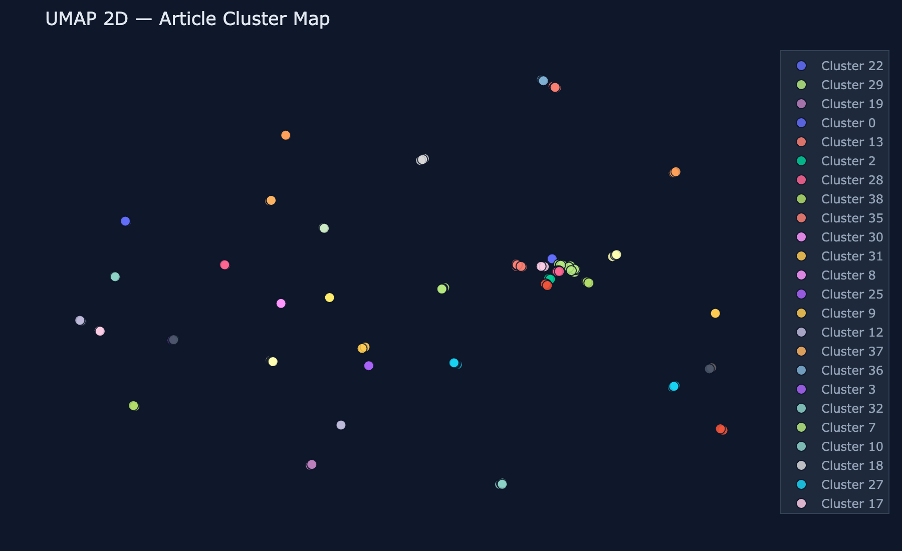

### 2. Sentiment Overlay Map
Overlays the FinBERT-predicted sentiment labels (positive, neutral, negative) onto the article UMAP spatial map to show how sentiment patterns are distributed across thematic clusters.
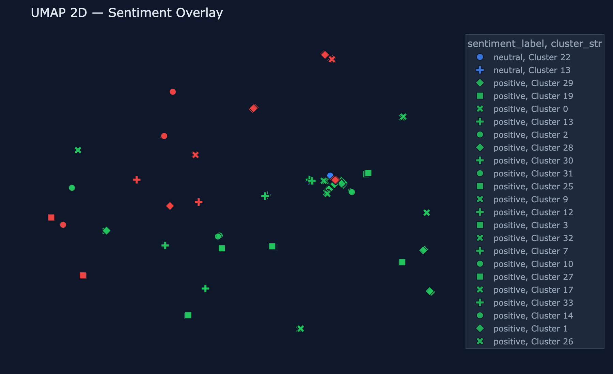

### 3. Cosine Similarity Heatmap
A pairwise cosine similarity matrix of the text embeddings. Brighter blue cells indicate articles with high semantic similarity, highlighting how clusters map to distinct article groups.
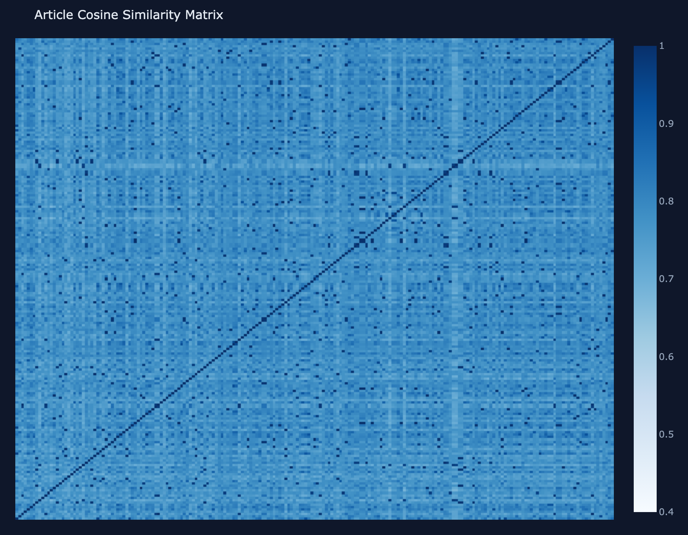

### 4. PCA Explained Variance
Shows the cumulative and individual explained variance ratio for the principal components. This visualization validates that reducing dimensions from 384 to 50 retains over 95% of the data variance, eliminating noise without losing structural information.
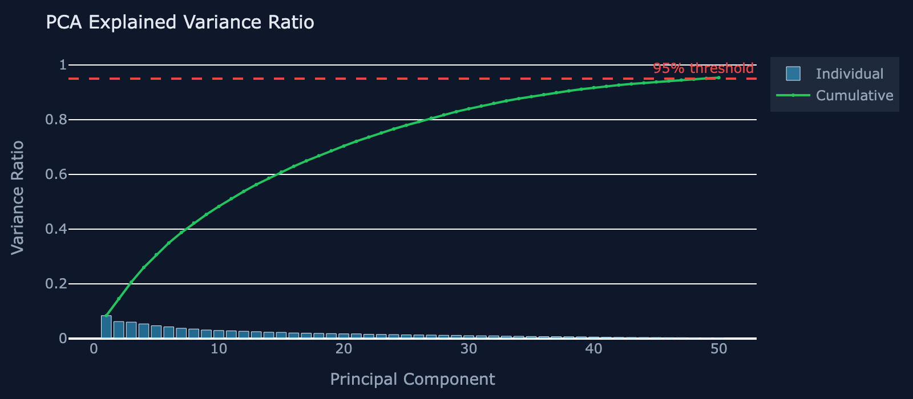

### 5. Sentiment Distribution
The overall breakdown of market sentiment labels across the dataset, highlighting the overall net sentiment score (market tone index).
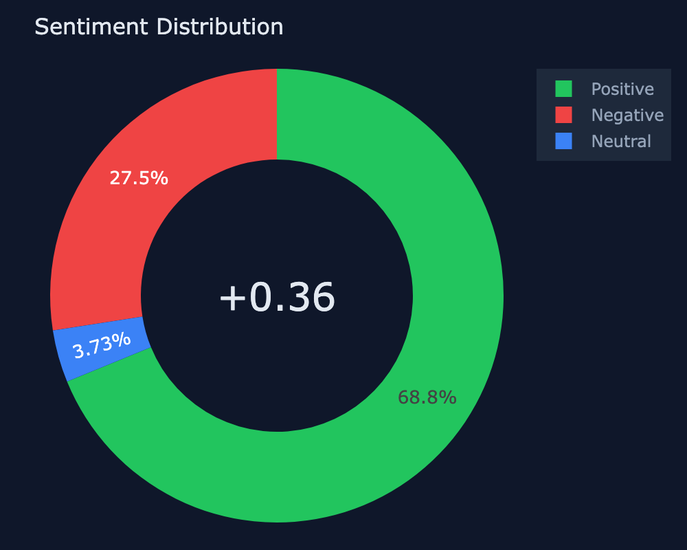

### 6. Sentiment Score Density
A stacked histogram detailing the counts of articles within specific score ranges (-1 to +1) for positive, neutral, and negative labels.
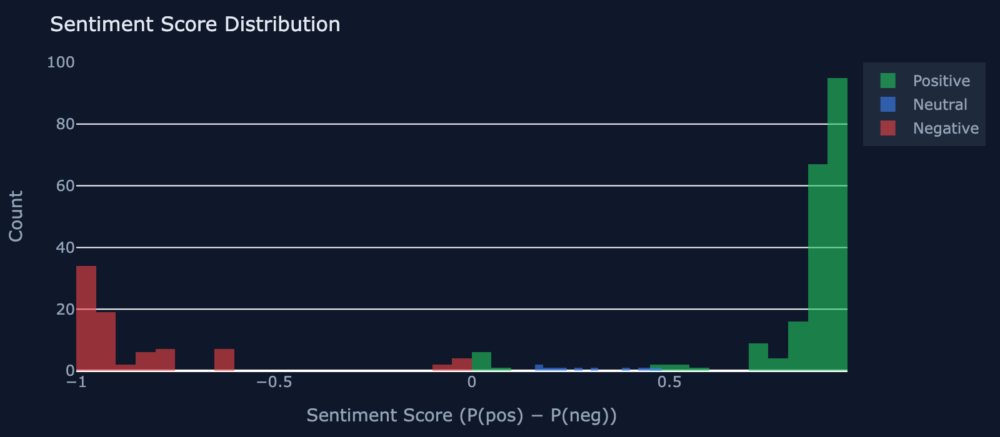

### 7. Average Sentiment by Cluster
Compares the thematic themes directly to show which market stories are driving bullish vs. bearish market tones.
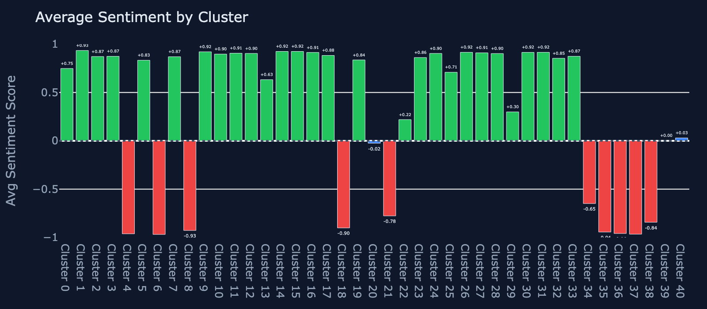

### 8. Sentiment and Volume Timeline
Overlays daily article counts (positive and negative) with the average composite market sentiment over time.
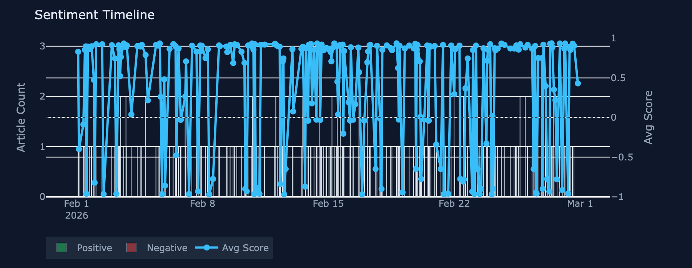

---

## API Endpoints

| Method | Endpoint | Description |
|--------|----------|-------------|
| GET | `/api/stats` | Platform-wide KPIs |
| GET | `/api/articles` | Paginated article list with filters |
| GET | `/api/articles/{id}` | Single article detail |
| GET | `/api/articles/umap-coords` | 2D scatter plot data |
| GET | `/api/clusters` | All cluster summaries |
| GET | `/api/clusters/{label}` | Cluster detail with articles |
| GET | `/api/sentiment/overview` | Sentiment aggregates + timeline |
| GET | `/api/sentiment/timeline` | Daily sentiment breakdown |
| POST | `/api/pipeline/run` | Trigger pipeline stages |

Interactive docs at **http://localhost:8000/docs** (Swagger UI).

---

## License

MIT
